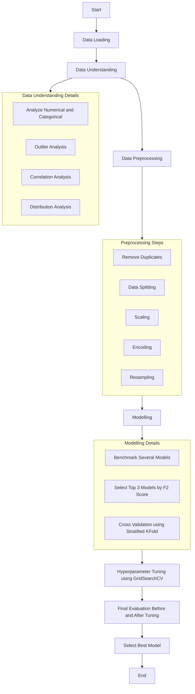

# Capstone Module 3 - Telco Cutomer Churn Prediction

## Business Problem Understanding
Sebuah perusahaan telekomunikasi kerap kali menghadapi risiko tinggi yang dapat mempengaruhi performa perusahaan, yaitu churn. Churn pada perusahaan telekomunikasi atau layanan berbasis langganan mengindikasikan situasi ketika pelanggan memutuskan untuk meninggalkan penyedia layanan. Oleh karena itu, Untuk mengurangi kehilangan pelanggan, perusahaan perlu memantau pelanggan yang berhenti dan faktor-faktor yang meningkatkan risiko churn.
### Stakeholder
- Management: sebagai decision maker dalam menerapkan program retensi dan pertumbuhan bisnis jangka panjang
- Marketing Team: untuk merancang kampanye retensi, promosi, dan penawaran khusus agar pelanggan tetap berlangganan.
- Product Management Team: untuk memperbaiki produk, paket layanan, dan pengalaman pelanggan.
### Problem Statement
Perusahaan telekomunikasi merupakan perusahaan yang bergantung pada pelanggan berulang. Oleh karena itu, pelanggan yang churn memiliki risiko tinggi dalam merugikan bisnis. Hal tersebut disebabkan karena perusahaan akan mengalami kerugian dan penurunan pendapatan berulang bulanan (MRR), yang dapat mengancam keberlanjutan bisnis. Selain itu, perusahaan perlu perusahaan perlu mengeluarkan biaya yang lebih tinggi, biasanya mencakup biaya teknisi dan perangkat untuk pelanggan baru. Oleh karena itu, model prediksi churn yang andal diperlukan untuk membantu perusahaan menjaga stabilitas dan mengurangi kerugian bisnis.
### Goals
Membangun model klasfikasi yang akurat untuk dapat memprediksi potensi pelanggan churn dengan baik. Sehingga, perusahaan dapat menargetkan program retensi yang dapat mengurangi churn
Mengidentifikasi faktor yang dapat mempengaruhi churn
### Metric Evaluation
Berdasarkan permasalahan yang telah dipaparkan, konsekuensi dari False Negative lebih merugikan dibandingkan False Positive, karena perusahaan berpotensi kehilangan pelanggan dan pendapatan. Sementara itu, konsekuensi False Positive (biaya marketing kurang tepat sasaran) masih dapat memberikan efek positif berupa peningkatan engagement pelanggan. Oleh karena itu, fokus evaluasi model diarahkan pada metrik yang menekankan kemampuan mendeteksi pelanggan berisiko churn, yaitu:
- F2-Score: Mempertimbangkan recall dan precision, namun memberikan bobot lebih besar pada recall. Dengan demikian, F2-Score membantu meminimalkan False Negative agar lebih banyak pelanggan yang berisiko churn dapat terdeteksi dengan benar.
- Recall: Mengukur seberapa banyak pelanggan churn yang berhasil terdeteksi dengan benar oleh model.
- AUC Score: Menggambarkan kemampuan model dalam membedakan antara pelanggan churn dan non-churn secara keseluruhan

## Data Source
| Feature           | Description |
|-------------------|-------------|
| Dependents        | Whether the customer has dependents or not. |
| Tenure            | Number of months the customer has stayed with the company. |
| OnlineSecurity    | Whether the customer has online security or not. |
| OnlineBackup      | Whether the customer has online backup or not. |
| InternetService   | Whether the client is subscribed to Internet service. |
| DeviceProtection  | Whether the client has device protection or not. |
| TechSupport       | Whether the client has tech support or not. |
| Contract          | Type of contract according to its duration. |
| PaperlessBilling  | Indicates whether bills are issued in paperless form. |
| MonthlyCharges    | Monthly amount charged to the customer. |
| Churn             | Indicates whether the customer churns or not. |

## Workflow

## Conclusion
Berdasarkan hasil pemodelan klasifikasi, model AdaBoost dengan hyperparameter tuning (Best Parameters:
algorithm = SAMME, estimator = DecisionTreeClassifier(class_weight='balanced', max_depth=3),
learning_rate = 0.1, n_estimators = 400) memberikan performa terbaik.

Model ini mampu mengurangi hingga 73% pelanggan yang tidak churn agar tidak salah sasaran dalam pemberian program retensi.
Di sisi lain, model berhasil mendeteksi sebagian besar pelanggan yang benar-benar berpotensi churn dengan nilai recall sebesar 82%.

Dengan demikian, perusahaan dapat:

- Menargetkan program retensi secara lebih tepat kepada pelanggan yang berisiko churn.
- Mengurangi potensi kehilangan pelanggan.
- Meminimalkan revenue loss akibat churn yang tidak terdeteksi.

Selain itu, beberapa faktor utama yang berpengaruh terhadap churn meliputi:
- Tipe kontrak berlangganan yang bersifat jangka pendek
- Durasi berlangganan (tenure) yang singkat
- Tidak memiliki Online Security
- Biaya berlangganan yang tinggi

## Recommendation
*Company / Stakeholder*

Perusahaan dapat menerapkan program retensi dengan memberikan insentif bagi pelanggan dengan kontrak dan durasi berlangganan singkat agar beralih ke paket jangka panjang. Insentif bisa berupa diskon, tambahan fitur online security gratis sementara, atau bonus layanan ketika pelanggan memperpanjang langganan.

*Project / Model*
- Menambah data historis serta fitur baru (misalnya frekuensi penggunaan, jumlah keluhan, riwayat pembayaran) untuk meningkatkan akurasi model
- Mencoba teknik resampling lain seperti oversampling, undersampling, atau metode hybrid (SMOTEENN, SMOTETomek)
- Mengeksplorasi model klasifikasi lain seperti Naive Bayes, SVM, atau Kernel SVM untuk membandingkan performa.
